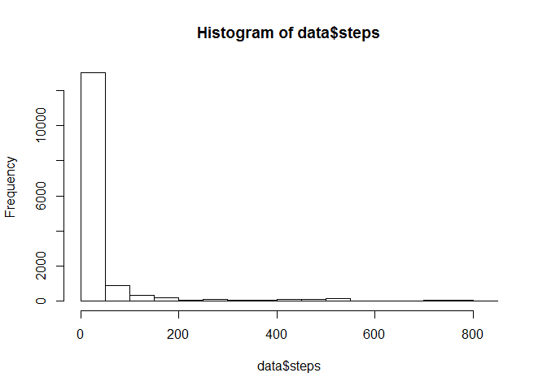
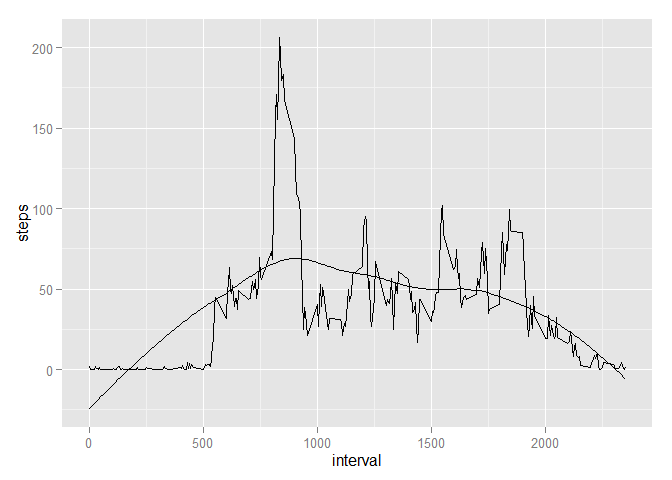
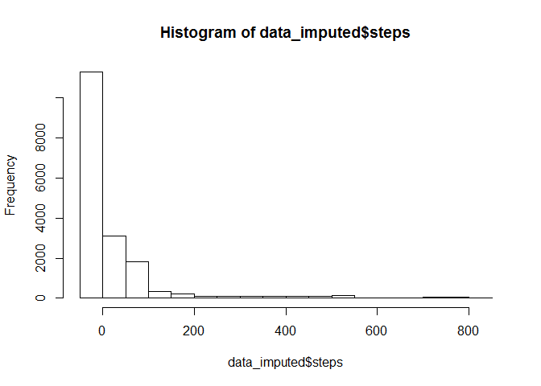
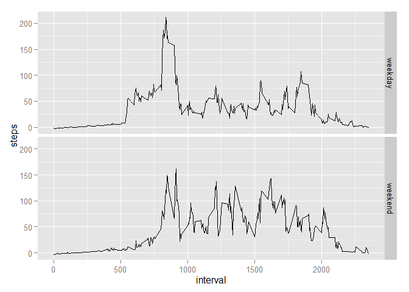

# Reproducible Research: Peer Assessment 1 - By Shay


## Loading packages and data 

```r
library(ggplot2)
library(dplyr)
```

```
## 
## Attaching package: 'dplyr'
## 
## The following objects are masked from 'package:stats':
## 
##     filter, lag
## 
## The following objects are masked from 'package:base':
## 
##     intersect, setdiff, setequal, union
```

```r
data <- read.csv("./activity.csv")
```

#### change date column to Date type 

```r
data$date <- as.Date(as.character(data$date), "%Y-%m-%d")
```

## What is mean total number of steps taken per day?

#### aggregate steps by day


```r
day_group <- group_by(data,date)
data_byday <- summarize(day_group,
                        steps = sum(steps)
                        )
```

```r
hist(data_byday$steps)
```

 

```r
mean <- mean(data_byday$steps,na.rm=TRUE)
median <- median(data_byday$step,na.rm=TRUE)
```

#### Mean is 1.0766189\times 10^{4}
#### Median is 10765

## What is the average daily activity pattern?

#### Calculate the mean by interval ignoring NA's

```r
interval_group <- group_by(data,interval)
data_byinterval <- summarize(interval_group,
                             AverageSteps = mean(steps, na.rm=TRUE)
)
```
                                                          
#### Plot results

```r
ggplot(data_byinterval, aes(x=interval,y=AverageSteps))+geom_line()
```

 

#### Select interval with highest average number of steps

```r
data_byinterval <- data_byinterval[order(-data_byinterval$AverageSteps),]
max_steps_time <- data_byinterval[1,]$interval
```
#### Time witih highest number of steps is 835. Indicates people starting their day at 8:35AM and going to work.

## Imputing missing values

####calculate number of rows w nas


```r
NA_rows <- nrow(data) - nrow(data[complete.cases(data),]) 
```
####Number of rows with NAs is 2304.

####Impute values for NAs using loess model based on interval time. Set negative predictions to zero.

```r
Steps_Loess <- loess(AverageSteps ~ interval, span=.75, data_byinterval)
LoessPredicted <- predict(Steps_Loess,data_byinterval$interval)
data_byinterval <- cbind(data_byinterval,LoessPredicted)
data_byinterval$LoessPredicted[data_byinterval$LoessPredicted<=0] <- 0 
```

#### Here is representation of the model. It has obvious flaws but will use it for illustration purposes.

```r
ggplot(data_byinterval, aes(x=interval,y=AverageSteps)) + 
geom_line(aes(interval,LoessPredicted)) +
geom_line(aes(interval,AverageSteps))
```

 

#### Create a seperate data set and impute NAs with loess model above.

```r
data_imputed <- data

# Merge by columns with different names
data_imputed <- merge(data_imputed, data_byinterval[c('interval','LoessPredicted')], by.x = "interval", by.y = "interval")

#data_imputed$PredSteps <- predict(Steps_Loess,data_imputed$interval)
data_imputed$steps[is.na(data_imputed$steps)] <- data_imputed$LoessPredicted
```

```
## Warning in data_imputed$steps[is.na(data_imputed$steps)] <- data_imputed
## $LoessPredicted: number of items to replace is not a multiple of
## replacement length
```

#### Create histogram, mean, and median with imputed data

```r
day_group <- group_by(data_imputed,date)
data_byday_imputed <- summarize(day_group,
                        steps = sum(steps)
                        )


hist(data_byday_imputed$steps)
```

 

```r
imputed_mean <- mean(data_byday_imputed$steps,na.rm=TRUE)
imputed_median <- median(data_byday_imputed$step,na.rm=TRUE)
```

#### Mean is 9468.1840354 compared to the original value of 1.0766189\times 10^{4}
#### Median is 1.0395\times 10^{4}. compared to the original value of 10765

## Are there differences in activity patterns between weekdays and weekends?


#### Create an additional column with weekday then group as 'weekend' and 'weekday'

```r
data_imputed$weekdays <- as.factor(weekdays(data_imputed$date))
data_imputed$day_type <- data_imputed$weekdays
levels(data_imputed$day_type) <- c("weekday","weekday","weekend","weekend","weekday","weekday","weekday")

summary_imputed <- aggregate(data_imputed["steps"], by=data_imputed[c("day_type","interval")], FUN=mean)
```


#### Plot the summary as before split by weekend and weekday. Weekend has a later, gradual ramp up in steps. Peak is still roughly the same time but at a lower level.

```r
ggplot(summary_imputed, aes(x=interval,y=steps, group=day_type)) +
facet_grid(day_type ~ .) +
geom_line() 
```

 


