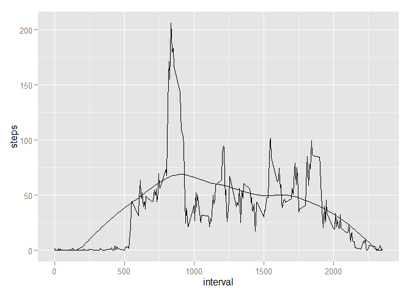

# Reproducible Research: Peer Assessment 1 - By Shay (First Change)


## Loading libraries and preprocessing the data

```r
library(ggplot2)
```

```
## Warning: package 'ggplot2' was built under R version 3.2.2
```

```r
data <- read.csv("./activity.csv")
```

### change date column to Date type 

```r
data$date <- as.Date(as.character(data$date), "%Y-%m-%d")
```

## What is mean total number of steps taken per day?

```r
hist(data$steps)
```

 

```r
mean <- mean(data$steps,na.rm=TRUE)
median <- median(data$step,na.rm=TRUE)
```

#### Mean is 37.3825996
#### Median is 0

## What is the average daily activity pattern?

#### Calculate the mean by interval ignoring NA's

```r
summary <- aggregate(data["steps"], by=data[c("interval")], FUN=mean, na.rm=TRUE)
```

#### Plot results

```r
ggplot(summary, aes(x=interval,y=steps))+geom_line()
```

 

#### Select interval with highest average number of steps

```r
summary <- summary[order(-summary$steps),]
max_steps_time <- summary[1,]$interval
```
#### Time witih highest number of steps is 835. Indicates people starting their day at 8:35AM and going to work.

## Imputing missing values

####calculate number of rows w nas


```r
NA_rows <- nrow(data) - nrow(data[complete.cases(data),]) 
```
####Number of rows with NAs is 2304.

####Impute values for NAs using loess model based on interval time

```r
Steps_Loess <- loess(steps ~ interval, span=.75, summary)
LoessPredicted <- predict(Steps_Loess,summary)
summary <- cbind(summary,LoessPredicted)
```

#### Here is representation of the model. It has obvious flaws but will use it for illustration purposes.

```r
ggplot(summary, aes(x=interval,y=steps)) + 
geom_line(aes(interval,LoessPredicted)) +
geom_line(aes(interval,steps))
```

 

#### Create a seperate data set and impute NAs with loess model above.

```r
data_imputed <- data
data_imputed$PredSteps <- predict(Steps_Loess,data_imputed$interval)
data_imputed$steps[is.na(data_imputed$steps)] <- data_imputed$PredSteps
```

```
## Warning in data_imputed$steps[is.na(data_imputed$steps)] <- data_imputed
## $PredSteps: number of items to replace is not a multiple of replacement
## length
```

#### Create histogram, mean, and median with imputed data

```r
hist(data_imputed$steps)
```

 

```r
imputed_mean <- mean(data_imputed$steps,na.rm=TRUE)
imputed_median <- median(data_imputed$step,na.rm=TRUE)
```

#### Mean is 37.3923696 compared to the original value of 37.3825996
#### Median is 0. compared to the original value of 0

## Are there differences in activity patterns between weekdays and weekends?


```r
data_imputed$weekdays <- as.factor(weekdays(data_imputed$date))
data_imputed$day_type <- data_imputed$weekdays
levels(data_imputed$day_type) <- c("weekday","weekday","weekend","weekend","weekday","weekday","weekday")

summary_imputed <- aggregate(data_imputed["steps"], by=data_imputed[c("day_type","interval")], FUN=mean)
```


#### Plot the summary as before

```r
ggplot(summary_imputed, aes(x=interval,y=steps, group=day_type)) +
facet_grid(day_type ~ .) +
geom_line() 
```

 


